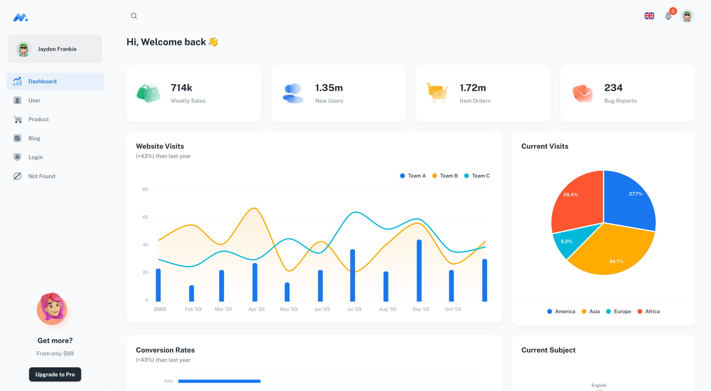

## Minimal [(Free version)](https://minimal-kit-react.vercel.app/)

> Free React Admin Dashboard made with Material-UI components and React.

| Minimal Free     | [Minimal Pro](https://material-ui.com/store/items/minimal-dashboard/) |
| ---------------- | :-------------------------------------------------------------------- |
| **6** Demo pages | **50+** Demo pages                                                    |
| -                | ✓ [More components](https://minimals.cc/components)                   |
| -                | ✓ Next.js version                                                     |
| -                | ✓ TypeScript version                                                  |
| -                | ✓ Figma file                                                          |

## Pages

- [Dashboard](https://minimal-kit-react.vercel.app/)
- [Users](https://minimal-kit-react.vercel.app/user)
- [Product](https://minimal-kit-react.vercel.app/products)
- [Blog](https://minimal-kit-react.vercel.app/blog)
- [Login](https://minimal-kit-react.vercel.app/login)
- [Not Found](https://minimal-kit-react.vercel.app/404)

## Quick start

Recommended `Node.js v18.x`.

**Install:** `yarn install`

**Start:** `yarn dev`

**Build:** `yarn build`

## License

Distributed under the MIT License. See [LICENSE](https://github.com/minimal-ui-kit/minimal.free/blob/main/LICENSE.md) for more information.

## Contact us

Email us: support@minimals.cc
