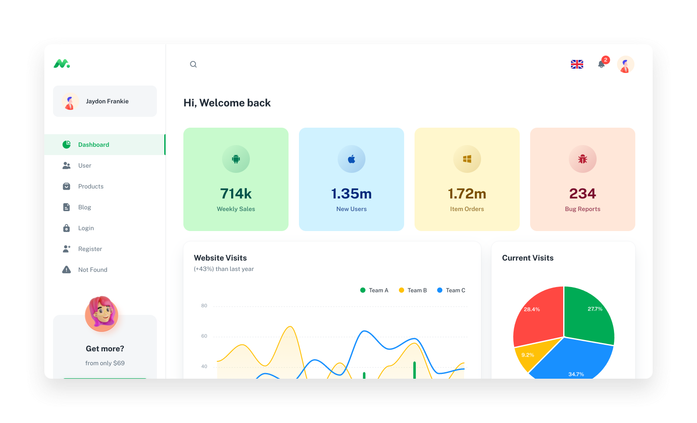

## Minimal UI [(Free version)](https://minimal-kit-react.vercel.app/)

> Free React Admin Dashboard made with Material UI components and React.

| [Minimal Kit FREE](https://minimal-kit-react.vercel.app/) | [Minimal Kit PRO](https://material-ui.com/store/items/minimal-dashboard/) |
| --------------------------------------------------------- | :------------------------------------------------------------------------ |
| **7** Demo Pages                                          | **38** demo pages                                                         |
| -                                                         | ✓ Multi Language                                                          |
| -                                                         | ✓ Dark/Light Mode 🌓                                                      |
| -                                                         | ✓ [More components](https://minimals.cc/components)                       |
| -                                                         | ✓ TypeScript version                                                      |
| -                                                         | ✓ Design files (sketch & figma)                                           |

## Page Demo

- [Dashboard](https://minimal-kit-react.vercel.app/dashboard/app)
- [Users](https://minimal-kit-react.vercel.app/dashboard/user)
- [Product](https://minimal-kit-react.vercel.app/dashboard/products)
- [Blog](https://minimal-kit-react.vercel.app/dashboard/blog)
- [Login](https://minimal-kit-react.vercel.app/login)
- [Register](https://minimal-kit-react.vercel.app/register)
- [Not Found](https://minimal-kit-react.vercel.app/404)

## Quick start

- Recommended `node js 14+` and `npm 6+`

- Install dependencies: `npm install` or `yarn`

- Start the server: `npm run start` or `yarn start`

## License

- Licensed under MIT (https://github.com/minimal-ui-kit/minimal.free/blob/main/LICENSE.md)

## Contact Us

- Email Us: support@minimals.cc
