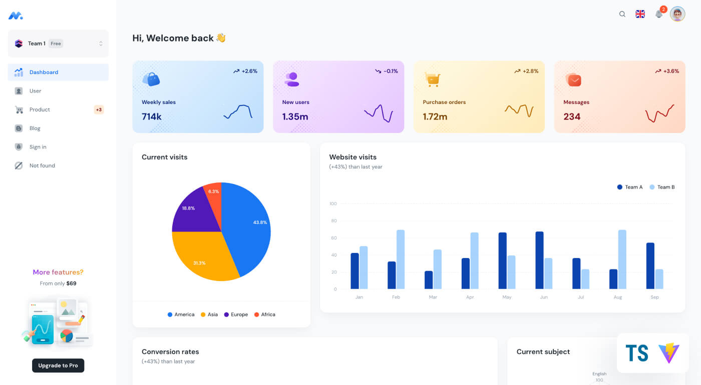

## Minimal UI ([Free version](https://minimal-kit-react.vercel.app/))

> Free React Admin Dashboard made with Material-UI components and React + Vite.js.

## Pages

- [Dashboard](https://minimal-kit-react.vercel.app/)
- [Users](https://minimal-kit-react.vercel.app/user)
- [Products](https://minimal-kit-react.vercel.app/products)
- [Blog](https://minimal-kit-react.vercel.app/blog)
- [Sign in](https://minimal-kit-react.vercel.app/sign-in)
- [Not found](https://minimal-kit-react.vercel.app/404)

## Quick start

- Clone the repo: `git clone https://github.com/minimal-ui-kit/material-kit-react.git`
- Recommended: `Node.js v20.x`
- **Install:** `npm i` or `yarn install`
- **Start:** `npm run dev` or `yarn dev`
- **Build:** `npm run build` or `yarn build`
- Open browser: `http://localhost:3039`

## Upgrade to PRO Version

| Minimal Free | [Minimal Pro](https://material-ui.com/store/items/minimal-dashboard/)                                    |
| :----------- | :------------------------------------------------------------------------------------------------------- |
| **6** Pages  | **70+** Pages                                                                                            |
| -            | **Next.js** version                                                                                      |
| -            | **TypeScript** version (Standard Plus and Extended license)                                              |
| -            | Design **Figma** file (Standard Plus and Extended license)                                               |
| -            | Authentication with **Amplify**, **Auth0**, **JWT**, **Firebase** and **Supabase**                       |
| -            | Light/dark mode, Right-to-left, form validation... ([+more components](https://minimals.cc/components) ) |
| -            | Complete users flows                                                                                     |
| -            | 1 year of free updates / 6 months of technical support                                                   |
| -            | Learn more: [Package & license](https://docs.minimals.cc/package)                                        |

## License

Distributed under the [MIT](https://github.com/minimal-ui-kit/minimal.free/blob/main/LICENSE.md) license.

## Contact us

Email: support@minimals.cc
